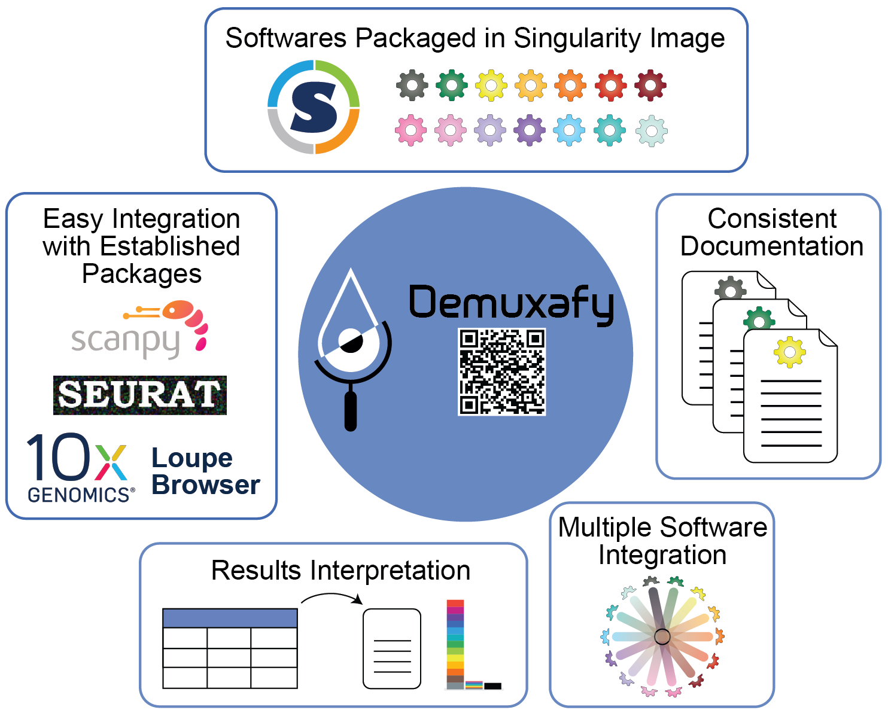
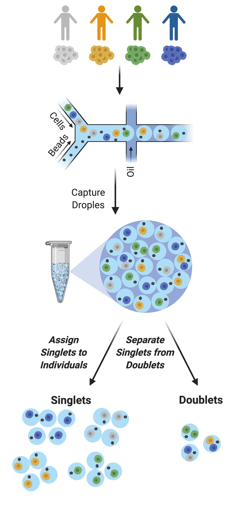
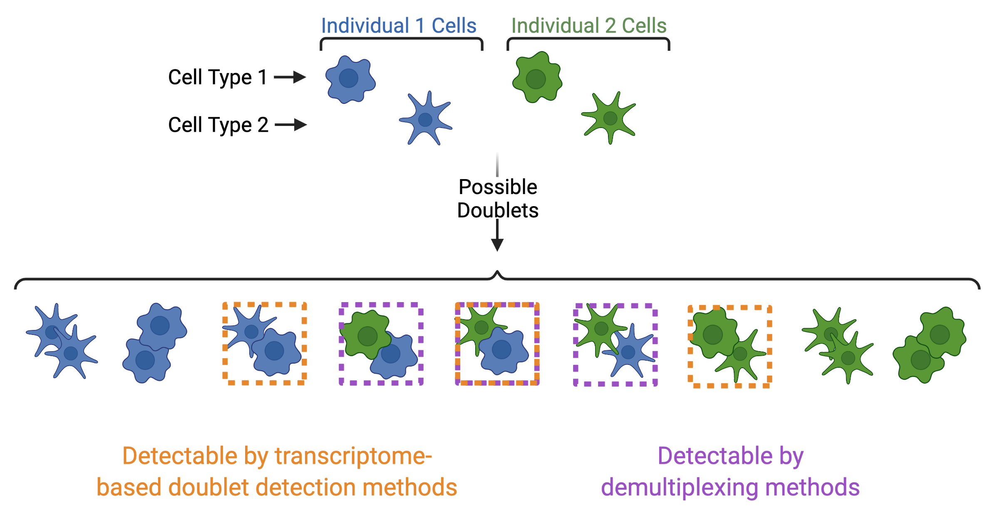

Background
==========================

Reason for this Software
--------------------------
Demultiplexing and detecting doublets is an important part of droplet-based scRNA-seq processing pipelines (see additional information and details :ref:`below <demuxltiplexing>`).

We described some of the best combinations of methods in our manuscript for demultiplexing and doublet detecting (also detailed in the :ref:`Software Selection Recommendations <SoftwareSelection-docs>`).
However, we acknowledge that each dataset is different and may have unique characteristics that make other softwares more suited.
Therefore, we have developed Demuxafy to enable each user to choose and run the demultiplexing and doublet detecting analyses of their choice smoothly and efficiently.

    **Figure 1: Demuxafy** | Demuxafy provides a simple framework for demultiplexing and classifying doublets in a wide range of droplet-based scRNA-seq captures.

Demuxafy contains all of the software you will need for any analysis into a singularity image that can be easily run on most HPCs.
This means that you do not need to install each software separately and provides standardization across studies and/or collaborations.
We have also built scripts that will easly summarize the results from each software for you - making the assessment of the success of a software faster and easier.
Finally, we provide a simple command that will easily combine the results from each of the individual softwares into a common dataframe and provide summary statistics about that combination.

We try our best to include all the possible methods for demultiplexing and doublet detecting in this image and maintain them up-to-date. 
If you notice a demultiplexing or doublet detecting software for scRNA-seq data that we have not included, please :ref:`reach out to us <Contact>`.

.. _demuxltiplexing:

Demultiplexing and Doublet Detecting Summary
--------------------------------------------

    **Figure 2: Multiplexed Single Cell Captures** | Cells from multiple donors can be pooled before capture. The goal post-capture is then to assign the singlets to the correct donor and to classify doublets for removal.

As droplet-based single cell technologies have advanced, increasingly larger sample numbers have been used to answer research questions at single cell resolution.
This has been made possible because, as the droplet-based capture technologies have been optimized, methods to pool and then demultiplex samples - assign droplets to each individual in the pool - have been developed (*Figure 2*).
These multiplexing methods clearly decrease cost and time of scRNA-seq experiments. 

With a larger number of droplets captured, there is an increase in the proportion of the droplets that are doublets (*Figure 3*).
If left in the dataset, doublets can significantly impact scientific conclusions such as identifying spurious cell trajectories or false novel cell types. 
Therefore, it's crucial to effectively clean datasets prior to downstream analyses.

.. figure:: https://user-images.githubusercontent.com/44268007/120289463-78db8200-c300-11eb-8317-9614efff9838.png
    :figwidth: 250px

    **Figure 3: Doublets per Number Droplets Captured** | Large droplet-based single cell captures result in large proportions of doublets.

In addition to demultiplexing softwares, there are also doublet detecting softwares that use the transcriptional profiles of droplets to identify doublets by simulating doublets.
Both demultiplexing and doublet doublet detecting softwares can be used to identify doublets in a dataset but identify differen types of doublets.
Demultiplexing methods can identify doublets from two different individuals whereases transcription-based doublet detecting methods can identify doublets between two different cell types (*Figure 4*).
This makes these two method types complementary for demultiplexing and doublet removal.

    **Figure 4: Doublets Identified by Demultiplexing and Doublet Detecting Methods** | Doublets can contain cells from different individuals or the same donor and the same or different cell types.
    Demultiplexing methods can only identify doublets from two different individuals while doublet detecting methods can only identify doublets from two different cell types.

Support
-------------
If you're having trouble with any part of the Demultiplexing and Doublet Detecting Pipeline, feel free to submit an `issue <https://github.com/drneavin/Demultiplexing_Doublet_Detecting_Docs/issues>`_.
