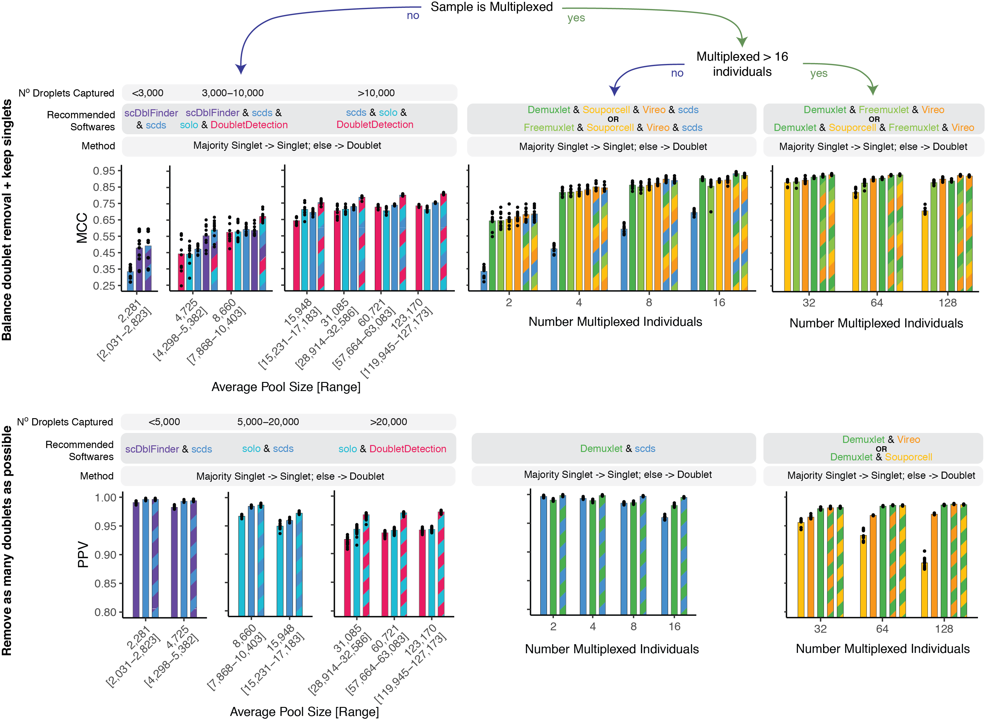

.. _SoftwareSelection-docs:

Software Selection Recommendations
==================================

Based on our analysis of demultiplexing and doublet detecting softwares, we have generated the following decision tree to help other researchers elect the best set of softwares for their dataset.
We have also put together a **selection widget (need to make and add link)** that will take you through each of the decision steps and provide advice regarding which softwares to use based on the characteristics of your dataset.

After you have run the softwares you selected, we have provided a script that will help merge and summarize the results from ethe softwares together.
See :ref:`Combine Results <Combine-docs>`.