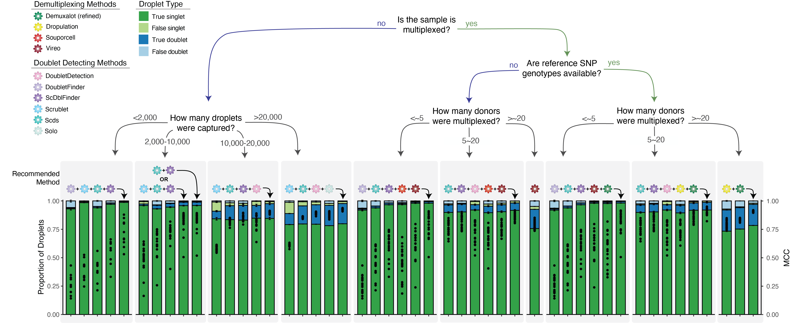

.. _SoftwareSelection-docs:

Software Selection Recommendations
==================================

Based on our analysis of demultiplexing and doublet detecting softwares, we have generated the following decision tree to help other researchers elect the best set of softwares for their dataset.

After you have run the softwares you selected, we have provided a script that will help merge and summarize the results from ethe softwares together.
See :ref:`Combine Results <Combine-docs>`.

In the future, we hope to implement additional tools that will assist in software selection.