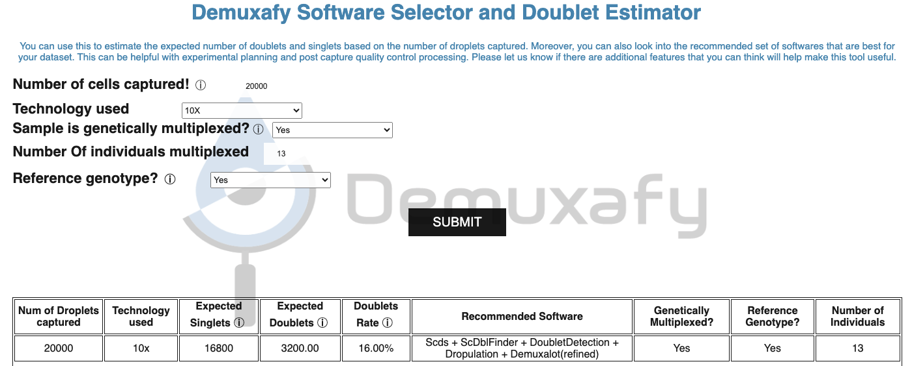

Tutorial
==========

In this tutorial, we'll analyze the :ref:`Test Dataset <TestData>` which contains 13 multiplexed donors and ~20,982 droplets.

This tutorial will take you through the typical steps for demultiplexing data with Demuxafy. 
The process would be the same for non-multiplexed data for doublet detection but would be a different combination of softwares.

1. Select appropriate software combination

2. Run each selected software

3. Combine the results and call a final assignment for each droplet

Selecting Software Combination
-------------------------------
First, we'll identify the softwares we should run using the :ref:`Software Selection Tool <SoftwareSelection-docs>`.
Start by entering the required information about the single-cell run into the :ref:`Software Selection Tool <SoftwareSelection-docs>`.
This sample is genetically multiplexed with reference SNP genotypes for each sample in the pool and 13 donors.
When we enter that information and press "SUBMIT", we can see the recommended method combination in the table below:

.. admonition:: Note

  If you want to compare different capture characteristics for experimental design, the recommendations and expected doublet numbers will be maintained in the table for easy comparison.

Per the recommendations we will run the following methods before combining them.

- Demuxalot (refined)
- Dropulation
- DoubletDetection
- ScDblFinder
- Scds

 

Run Each Software
-------------------------------
We will first run each software before combining them and calling final assignments for each droplet based on the annotations from each software.
Please note that even though they are listed in sequence here, we run them in parallel since none of them are dependent on the other

Data
^^^^^^
This is the data that you will need to have prepared to run each of the softwares and the softwares that use them:

.. admonition:: Required
  :class: important

  - Reference SNP genotypes for each individual (``$VCF``)

    - Filtered for common SNPs (> 5% minor allele frequency) and SNPs overlapping genes

  - Barcode file (``$BARCODES``)

    - A file that has the barcodes annotated to contain cells in pool. One barcode per line, no header.

  - Bam file (``$BAM``)

    - Aligned single cell reads

  - Output directory (``$OUTDIR``)

  - A text file with the individual ids (``$INDS``)
    
    - File containing the individual ids (separated by line) as they appear in the vcf file

    - For example, this is the :download:`individual file <_download_files/Individuals.txt>` for our example dataset

Here's an example of our folder tree setup that will be used for this tutorial:

.. code-block:: bash

  /path/to/data/
  └── TestData4PipelineFull
      ├── donor_list.txt
      ├── samplesheet.txt
      ├── test_dataset
      │   ├── outs
      │   │   └── filtered_gene_bc_matrices
      │   │       └── Homo_sapiens_GRCh38p10
      │   │           ├── barcodes.tsv
      │   │           ├── genes.tsv
      │   │           └── matrix.mtx
      │   ├── possorted_genome_bam.bam
      │   └── possorted_genome_bam.bam.bai
      └── test_dataset.vcf

We'll start by setting up variables to different files and folders that we need for running each of the softwares
These are files provided as a :ref:`test dataset <TestData>` available in the :ref:`Data Preparation Documentation <DataPrep-docs>`
Please replace ``/path/to`` with the full path to your data directory.

.. code-block:: bash

  ## Paths to files ##
  VCF=/path/to/TestData4PipelineFull/test_dataset.vcf
  COUNTS=/path/to/TestData4PipelineFull/test_dataset/outs/filtered_gene_bc_matrices/Homo_sapiens_GRCh38p10/
  BARCODES=$COUNTS/barcodes.tsv
  BAM=/path/to/TestData4PipelineFull/test_dataset/possorted_genome_bam.bam
  INDS=/path/to/TestData4PipelineFull/donor_list.txt
  GTF=/path/to/genes.gtf ## We do Not provide this - it should be the gtf file that you used to align your data. Otherwise you can download an appropriate gtf file from https://www.gencodegenes.org/human/

  ## Output directories ##
  OUTDIR=/path/to/output
  DEMUXALOT_OUTDIR=$OUTDIR/demuxalot
  DROPULATION_OUTDIR=$OUTDIR/dropulation
  DOUBLETDETECTION_OUTDIR=$OUTDIR/DoubletDetection
  SCDBLFINDER_OUTDIR=$OUTDIR/scDblFinder
  SCDS_OUTDIR=$OUTDIR/scds

Demuxalot (refined)
^^^^^^^^^^^^^^^^^^^^^
We'll run Demuxalot with variant refinement:

.. admonition:: |:stopwatch:| Expected Resource Usage
  :class: note

  ~2.5h using a total of 81Gb memory when using 32 threads

.. code-block:: bash

  singularity exec Demuxafy.sif python Demuxalot.py \
          -b $BARCODES \
          -a $BAM \
          -n $INDS \
          -v $VCF \
          -o $DEMUXALOT_OUTDIR \
          -r True

.. admonition:: HELP! It says my file/directory doesn't exist!
  :class: dropdown

  If you receive an error indicating that a file or directory doesn't exist but you are sure that it does, this is likely an issue arising from Singularity.
  This is easy to fix.
  The issue and solution are explained in detail in the :ref:`Notes About Singularity Images <Singularity-docs>`

If Demuxalot is successful, you will have these new files in your ``$DEMUXALOT_OUTDIR``:

.. code-block:: bash

  /path/to/output/demuxalot
  ├── assignments_refined.tsv.gz
  ├── assignments.tsv.gz
  ├── likelihoods_refined.tsv.gz
  ├── likelihoods.tsv.gz
  ├── posterior_probabilities_refined.tsv.gz
  └── posterior_probabilities.tsv.gz

Let's check how many droplets were assigned as each donor and as doublets by Demuxalot with the ``demuxalot_summary.sh`` script:

.. code-block:: bash

  singularity exec Demuxafy.sif bash demuxalot_summary.sh $DEMUXALOT_OUTDIR/assignments_refined.tsv.gz

which will return:

+-----------------+--------------+
| Classification  | Assignment N |
+=================+==============+
| 113_113         | 1344         |
+-----------------+--------------+
| 349_350         | 1463         |
+-----------------+--------------+
| 352_353         | 1619         |
+-----------------+--------------+
| 39_39           | 1306         |
+-----------------+--------------+
| 40_40           | 1082         |
+-----------------+--------------+
| 41_41           | 1129         |
+-----------------+--------------+
| 42_42           | 1437         |
+-----------------+--------------+
| 43_43           | 1553         |
+-----------------+--------------+
| 465_466         | 1091         |
+-----------------+--------------+
| 596_597         | 1267         |
+-----------------+--------------+
| 597_598         | 1523         |
+-----------------+--------------+
| 632_633         | 872          |
+-----------------+--------------+
| 633_634         | 961          |
+-----------------+--------------+
| 660_661         | 1371         |
+-----------------+--------------+
| doublet         | 2964         |
+-----------------+--------------+

The estimated number of doublets (2,964) is slightly lower than the predicted number of doublets (3,522)

Dropulation
^^^^^^^^^^^^
We'll also run Dropulation:

Dropulation Assignment
++++++++++++++++++++++++++++++
First, Dropulation estimates the likelihood of each donor for each droplet

.. admonition:: |:stopwatch:| Expected Resource Usage
  :class: note

  ~4h using a total of 3Gb memory when using 12 threads

Please note that the ``\`` at the end of each line is purely for readability to put a separate parameter argument on each line.

.. code-block:: bash

  singularity exec Demuxafy.sif AssignCellsToSamples --CELL_BC_FILE $BARCODES \
            --INPUT_BAM $DROPULATION_OUTDIR/possorted_genome_bam_dropulation_tag.bam \
            --OUTPUT $DROPULATION_OUTDIR/assignments.tsv.gz \
            --VCF $VCF \
            --SAMPLE_FILE $INDS \
            --CELL_BARCODE_TAG 'CB' \
            --MOLECULAR_BARCODE_TAG 'UB' \
            --VCF_OUTPUT $DROPULATION_OUTDIR/assignment.vcf \
            --MAX_ERROR_RATE 0.05

If the bam annotation is successful, you will have these new files in your ``$DROPULATION_OUTDIR``:

.. code-block:: bash
  :emphasize-lines: 2,3,4

  /path/to/output/dropulation
  ├── assignments.tsv.gz
  ├── out_vcf.vcf
  ├── out_vcf.vcf.idx
  └── possorted_genome_bam_dropulation_tag.bam

.. admonition:: |:stopwatch:| Expected Resource Usage
  :class: note

  ~1.5h using a total of 5Gb memory when using 16 thread for the full :ref:`Test Dataset <TestData>` which contains ~20,982 droplets of 13 multiplexed donors,

Next, we will identify the likelihoods of each droplet being a doublet.

.. admonition:: Note
  :class: note

  Please change the cell barcode and molecular barcode tags as necessary. 
  For 10x experiments processed with cellranger, this should be 'CB' for the ``CELL_BARCODE_TAG`` and 'UB' for the ``MOLECULAR_BARCODE_TAG``

Please note that the ``\`` at the end of each line is purely for readability to put a separate parameter argument on each line.

.. code-block:: bash

  singularity exec Demuxafy.sif DetectDoublets --CELL_BC_FILE $BARCODES \
            --INPUT_BAM $DROPULATION_OUTDIR/possorted_genome_bam_dropulation_tag.bam \
            --OUTPUT $DROPULATION_OUTDIR/likelihoods.tsv.gz \
            --VCF $VCF \
            --CELL_BARCODE_TAG 'CB' \
            --MOLECULAR_BARCODE_TAG 'UB' \
            --SINGLE_DONOR_LIKELIHOOD_FILE $DROPULATION_OUTDIR/assignments.tsv.gz \
            --SAMPLE_FILE $INDS \
            --MAX_ERROR_RATE 0.05

Dropulation Doublet
++++++++++++++++++++++++++++++
Next, Dropulation estimates the likelihood of a doublet for each droplet

.. admonition:: |:stopwatch:| Expected Resource Usage
  :class: note

  ~1.5h using a total of 5Gb memory when using 16 threads

Next, we will identify the likelihoods of each droplet being a doublet.

.. admonition:: Note
  :class: note

  Please change the cell barcode and molecular barcode tags as necessary. 
  For 10x experiments processed with cellranger, this should be 'CB' for the ``CELL_BARCODE_TAG`` and 'UB' for the ``MOLECULAR_BARCODE_TAG``

Please note that the ``\`` at the end of each line is purely for readability to put a separate parameter argument on each line.

.. code-block:: bash

  singularity exec Demuxafy.sif DetectDoublets --CELL_BC_FILE $BARCODES \
            --INPUT_BAM $DROPULATION_OUTDIR/possorted_genome_bam_dropulation_tag.bam \
            --OUTPUT $DROPULATION_OUTDIR/likelihoods.tsv.gz \
            --VCF $VCF \
            --CELL_BARCODE_TAG 'CB' \
            --MOLECULAR_BARCODE_TAG 'UB' \
            --SINGLE_DONOR_LIKELIHOOD_FILE $DROPULATION_OUTDIR/assignments.tsv.gz \
            --SAMPLE_FILE $INDS \
            --MAX_ERROR_RATE 0.05

Dropulation Call
^^^^^^^^^^^^^^^^^^^^^^^^^
Finally, we will make final assignments for each droplet based on the doublet and assignment calls.

Please note that the ``\`` at the end of each line is purely for readability to put a separate parameter argument on each line.

.. code-block:: bash

  singularity exec Demuxafy.sif dropulation_call.R --assign $DROPULATION_OUTDIR/assignments.tsv.gz \
                             --doublet $DROPULATION_OUTDIR/likelihoods.tsv.gz \
                             --out $DROPULATION_OUTDIR/updated_assignments.tsv.gz

If the bam annotation is successful, you will have these new files in your ``$DROPULATION_OUTDIR``:

.. code-block:: bash
  :emphasize-lines: 7

  /path/to/output/dropulation
  ├── assignments.tsv.gz
  ├── likelihoods.tsv.gz
  ├── out_vcf.vcf
  ├── out_vcf.vcf.idx
  ├── possorted_genome_bam_dropulation_tag.bam
  └── updated_assignments.tsv.gz
  

Dropulation Summary
++++++++++++++++++++++
We can check the distribution of cells that were assigned to each donor and annotated as doublets with the ``Dropulation_summary.sh`` script:

.. code-block:: bash

  singularity exec Demuxafy.sif bash Dropulation_summary.sh $DROPULATION_OUTDIR/updated_assignments.tsv.gz

which will return:

  +-----------------+--------------+
  | Classification  | Assignment N |
  +=================+==============+
  | 113_113         | 1327         |
  +-----------------+--------------+
  | 349_350         | 1440         |
  +-----------------+--------------+
  | 352_353         | 1562         |
  +-----------------+--------------+
  | 39_39           | 1255         |
  +-----------------+--------------+
  | 40_40           | 1082         |
  +-----------------+--------------+
  | 41_41           | 1122         |
  +-----------------+--------------+
  | 42_42           | 1365         |
  +-----------------+--------------+
  | 43_43           | 1546         |
  +-----------------+--------------+
  | 465_466         | 1084         |
  +-----------------+--------------+
  | 596_597         | 1258         |
  +-----------------+--------------+
  | 597_598         | 1515         |
  +-----------------+--------------+
  | 632_633         | 815          |
  +-----------------+--------------+
  | 633_634         | 892          |
  +-----------------+--------------+
  | 660_661         | 1364         |
  +-----------------+--------------+
  | doublet         | 3355         |
  +-----------------+--------------+

The estimated number of doublets (3,355) is very close to the predicted number of doublets (3,522)

DoubletDetection
^^^^^^^^^^^^^^^^^^
We will also run DoubletDetection:

.. code-block:: bash

  singularity exec Demuxafy.sif DoubletDetection.py -m $COUNTS -o $DOUBLETDETECTION_OUTDIR

.. admonition:: HELP! It says my file/directory doesn't exist!
  :class: dropdown

  If you receive an error indicating that a file or directory doesn't exist but you are sure that it does, this is likely an issue arising from Singularity.
  This is easy to fix.
  The issue and solution are explained in detail in the :ref:`Notes About Singularity Images <Singularity-docs>`

This will return the following files:

.. code-block:: bash

  /path/to/output/DoubletDetection
  ├── convergence_test.pdf
  ├── DoubletDetection_doublets_singlets.tsv
  ├── DoubletDetection_summary.tsv
  └── threshold_test.pdf

Looking at the ``DoubletDetection_summary.tsv`` file, the number of doublets (2,594) is lower than the predicted number of doublets (3,522)

  +------------------------------+-----------+
  | DoubletDetection_DropletType | Droplet N |
  +==============================+===========+
  | doublet                      | 2594      |
  +------------------------------+-----------+
  | singlet                      | 18388     |
  +------------------------------+-----------+

ScDblFinder
^^^^^^^^^^^^^^
We will also run ScDblFinder.

.. admonition:: |:stopwatch:| Expected Resource Usage
  :class: note

  ~1min using a total of 3Gb memory when using 2 thread for the full :ref:`Test Dataset <TestData>` which contains ~20,982 droplets of 13 multiplexed donors,

.. code-block:: bash

  singularity exec Demuxafy.sif scDblFinder.R -o $SCDBLFINDER_OUTDIR -t $COUNTS

.. admonition:: HELP! It says my file/directory doesn't exist!
  :class: dropdown

  If you receive an error indicating that a file or directory doesn't exist but you are sure that it does, this is likely an issue arising from Singularity.
  This is easy to fix.
  The issue and solution are explained in detail in the :ref:`Notes About Singularity Images <Singularity-docs>`

After running the ScDblFinder_ you will have two files in the ``$SCDBLFINDER_OUTDIR``:

.. code-block:: bash

	/path/to/output/scDblFinder
	├── scDblFinder_doublets_singlets.tsv
	└── scDblFinder_doublet_summary.tsv

Looking at the ``scDblFinder_doublet_summary.tsv`` file, the number of doublets (3,323) is slightly lower than the predicted number of doublets (3,522)

+----------------+-----------+
|Classification  | Droplet N |
+================+===========+
|doublet         | 3323      |
+----------------+-----------+
|singlet         | 17659     |
+----------------+-----------+

Scds
^^^^^^^^^
Finally, we will also run Scds.

.. admonition:: |:stopwatch:| Expected Resource Usage
  :class: note

  ~7min using a total of 10Gb memory when using 2 thread for the full :ref:`Test Dataset <TestData>` which contains ~20,982 droplets of 13 multiplexed donors,

To run Scds_ with our wrapper script, simply execute the following in your shell:

.. code-block:: bash

  singularity exec Demuxafy.sif scds.R -o $SCDS_OUTDIR -t $COUNTS

.. admonition:: HELP! It says my file/directory doesn't exist!
  :class: dropdown

  If you receive an error indicating that a file or directory doesn't exist but you are sure that it does, this is likely an issue arising from Singularity.
  This is easy to fix.
  The issue and solution are explained in detail in the :ref:`Notes About Singularity Images <Singularity-docs>`

After running the Scds_ with the wrapper script or manually you should have two files in the ``$SCDS_OUTDIR``:

.. code-block:: bash

	/path/to/output/scds
	├── scds_doublets_singlets.tsv
	└── scds_doublet_summary.tsv

Looking at the ``scds_doublet_summary.tsv`` file, the number of doublets (2,771) is lower than the predicted number of doublets (3,522)

Merging Results and Joint Software Calls
-----------------------------------------
Now, we will combine the results from each of the softwares we've run (Demuxalot (refined), Dropulation, DoubletDetection, ScDblFinder, Scds) and annotate droplet cell types and donor assignments 

.. code-block:: bash

  singularity exec Demuxafy.sif Combine_Results.R \
    -o $OUTDIR/combined_results.tsv \
    --demuxalot $DEMUXALOT_OUTDIR \
    --dropulation $DROPULATION_OUTDIR \
    --solo $DOUBLETDETECTION_OUTDIR \
    --scds $SCDBLFINDER_OUTDIR \
    --scds $SCDS_OUTDIR \
    --method "MajoritySinglet"

Results and Interpretation
--------------------------
After running the ``Combine_Results.R`` script, you will have have the following results
Here, we show the results for the above example that also provides combined calls with the "MajoritySinglet" calls.

.. code-block:: bash

  /path/to/output/combined
  ├── combined_results_assignment_summary.tsv
  ├── combined_results_demultiplexing_summary.tsv
  ├── combined_results_droplet_type_summary.tsv
  ├── combined_results_Singlets_upset_donor_assignment.pdf
  ├── combined_results_Singlets_upset_droplet_type.pdf
  ├── combined_results_Singlets_upset.pdf
  ├── combined_results_summary.tsv
  ├── combined_results.tsv
  └── combined_results_w_combined_assignments.tsv

  
Here's a deeper look at the contents of each of some of those files:

First, we can look at the combined calls in the upset plot (``combined_results_Singlets_upset.pdf``):

    - This is an upset figure of the droplets which are colored by their final individual or doublet classification.

    - A filled circle indicates the that those droplets are classified as singlets by that software while empty circles indicate a doublet classification by that software

    .. image:: _figures/combined_results_Singlets_upset_donor_assignment.png

There are also summary files that provide the number of droplets annotated as a singlet or doublet by the combined softwares ``combined_results_droplet_type_summary.tsv``:

+-----------------+-----------+
| Classification  | Droplet N |
+=================+===========+
| doublet         | 2771      |
+-----------------+-----------+
| singlet         | 18211     |
+-----------------+-----------+

and the number of droplets assigned to each donor and as doublets and unassigned by the combination of the softwares (``combined_results_assignment_summary.tsv``):

+-----------------+-----------+
| Classification  | Droplet N |
+=================+===========+
| 113_113         | 1333      |
+-----------------+-----------+
| 349_350         | 1443      |
+-----------------+-----------+
| 352_353         | 1607      |
+-----------------+-----------+
| 39_39           | 1289      |
+-----------------+-----------+
| 40_40           | 1072      |
+-----------------+-----------+
| 41_41           | 1123      |
+-----------------+-----------+
| 42_42           | 1409      |
+-----------------+-----------+
| 43_43           | 1542      |
+-----------------+-----------+
| 465_466         | 1084      |
+-----------------+-----------+
| 596_597         | 1249      |
+-----------------+-----------+
| 597_598         | 1493      |
+-----------------+-----------+
| 632_633         | 859       |
+-----------------+-----------+
| 633_634         | 953       |
+-----------------+-----------+
| 660_661         | 1354      |
+-----------------+-----------+
| doublet         | 2771      |
+-----------------+-----------+
| unassigned      | 401       |
+-----------------+-----------+

The ``combined_results.tsv`` file contains all the method calls + the combined finalized calls together in a single file that can be used as cell metadata for downstream analyses.

+--------------------+---------------------------------+--------------------------------+-------------------------+-------------------------------------+-----------------------------------------------+-------------------------+----------------------+-----------------------------+---------------------------------------+-----------------------------+---------------------------------------+
| Barcode            | Demuxalot_Individual_Assignment | Demuxalot_DropletType          | Dropulation_DropletType | Dropulation_Individual_Assignment   | DoubletDetection_DropletType                  | scDblFinder_DropletType | scDblFinder_Score    | scds_score                  | scds_DropletType                      | MajoritySinglet_DropletType | MajoritySinglet_Individual_Assignment |
+====================+=================================+================================+=========================+=====================================+===============================================+=========================+======================+=============================+=======================================+=============================+=======================================+
| AAACCTGAGATAGCAT-1 |      41_41                      | singlet                        | singlet                 | 41_41                               | singlet                                       | singlet                 | 0.000161838892381638 | 0.11384647224872            | singlet                               | singlet                     | 41_41                                 |
+--------------------+---------------------------------+--------------------------------+-------------------------+-------------------------------------+-----------------------------------------------+-------------------------+----------------------+-----------------------------+---------------------------------------+-----------------------------+---------------------------------------+
| AAACCTGAGCAGCGTA-1 |      465_466                    | singlet                        | singlet                 | 465_466                             | singlet                                       | singlet                 | 0.038923978805542    | 0.503487172824797           | singlet                               | singlet                     | 465_466                               |
+--------------------+---------------------------------+--------------------------------+-------------------------+-------------------------------------+-----------------------------------------------+-------------------------+----------------------+-----------------------------+---------------------------------------+-----------------------------+---------------------------------------+
| AAACCTGAGCGATGAC-1 |      113_113                    | singlet                        | singlet                 | 113_113                             | singlet                                       | singlet                 | 0.000687798717990518 | 0.0122651890679041          | singlet                               | singlet                     | 113_113                               |
+--------------------+---------------------------------+--------------------------------+-------------------------+-------------------------------------+-----------------------------------------------+-------------------------+----------------------+-----------------------------+---------------------------------------+-----------------------------+---------------------------------------+
| AAACCTGAGCGTAGTG-1 |      349_350                    | singlet                        | singlet                 | 349_350                             | singlet                                       | singlet                 | 6.88672153046355e-05 | 0.099564348390602           | singlet                               | singlet                     | 349_350                               |
+--------------------+---------------------------------+--------------------------------+-------------------------+-------------------------------------+-----------------------------------------------+-------------------------+----------------------+-----------------------------+---------------------------------------+-----------------------------+---------------------------------------+
| AAACCTGAGGAGTTTA-1 |      632_633                    | singlet                        | singlet                 | 632_633                             | singlet                                       | singlet                 | 0.000810008263215423 | 0.0887153542233592          | singlet                               | singlet                     | 632_633                               |
+--------------------+---------------------------------+--------------------------------+-------------------------+-------------------------------------+-----------------------------------------------+-------------------------+----------------------+-----------------------------+---------------------------------------+-----------------------------+---------------------------------------+
| AAACCTGAGGCTCATT-1 |      39_39                      | singlet                        | singlet                 | 39_39                               | singlet                                       | singlet                 | 0.0342786461114883   | 0.0521116636059276          | singlet                               | singlet                     | 39_39                                 |
+--------------------+---------------------------------+--------------------------------+-------------------------+-------------------------------------+-----------------------------------------------+-------------------------+----------------------+-----------------------------+---------------------------------------+-----------------------------+---------------------------------------+
| AAACCTGAGGGCACTA-1 |      465_466                    | singlet                        | singlet                 | 465_466                             | singlet                                       | doublet                 | 0.962486505508423    | 0.600842973151551           | singlet                               | singlet                     | 465_466                               |
+--------------------+---------------------------------+--------------------------------+-------------------------+-------------------------------------+-----------------------------------------------+-------------------------+----------------------+-----------------------------+---------------------------------------+-----------------------------+---------------------------------------+
| AAACCTGAGTAATCCC-1 |      660_661                    | singlet                        | singlet                 | 660_661                             | singlet                                       | singlet                 | 0.00426467135548592  | 0.431225466194795           | singlet                               | singlet                     | 660_661                               |
+--------------------+---------------------------------+--------------------------------+-------------------------+-------------------------------------+-----------------------------------------------+-------------------------+----------------------+-----------------------------+---------------------------------------+-----------------------------+---------------------------------------+
| ...                | ...                             | ...                            | ...                     | ...                                 | ...                                           | ...                     | ...                  | ...                         | ...                                   | ...                         |...                                    |
+--------------------+---------------------------------+--------------------------------+-------------------------+-------------------------------------+-----------------------------------------------+-------------------------+----------------------+-----------------------------+---------------------------------------+-----------------------------+---------------------------------------+

You have completed the Tutorial! You can now apply the required methods to your dataset.
Feel free to reach out if you have any questions, issues or recommendations with a `Github issue <https://github.com/drneavin/Demultiplexing_Doublet_Detecting_Docs/issues>`__.

Citation
--------
If you used the Demuxafy platform for analysis, please reference our preprint_ as well as `DoubletDetection <https://zenodo.org/record/4359992>`__.
